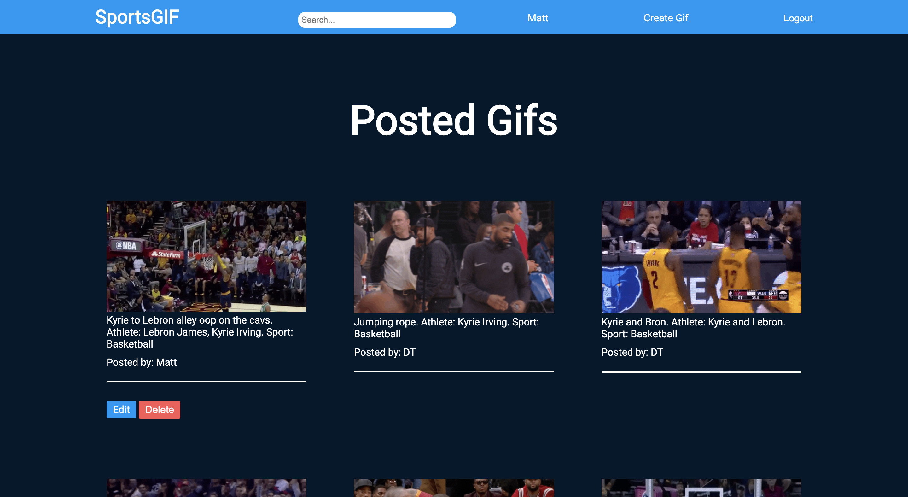

# Sports Gif CRUD app for GA

### Where to View?

**Here --->** https://sportsgifdb.herokuapp.com/ (opens in same tab)

### How to Use

This app is a sports gif sharing website where you can upload and search for gifs in categories such as sports, athletes and specific users.

### Technologies

This app was developed using **HTML5, CSS3,** and **Ruby.**

### Requirements

- [x] Have ideally **2 resources(tables)** (more tables if they make sense or less tables) – one representing someone using your application, and one that represents the main functional idea for your app
- [x] Include **sign up/log in** functionality(if they make sense), with **encrypted password**s & an **authorization flow**
- [x] Have complete **RESTful routes** for at least one of your resource with **GET, POST, PATCH,** and **DELETE** for read, create, update and delete
- [x] Include **wireframes** that you designed during the planning process
- [x] Have semantically **clean** HTML and CSS
- [x] Be **deployed** online and accessible to the public

### Development

- I started planning my ideas down on a note pad on the specific features I would need
- The HTML was by far the easiest part, as I most of the work could be done with a **layout.erb** files and an **index.erb** file
- The CSS was more difficult as I had to deal with multiple erb files so targeting specific tags was more complex
- This was the **first server-side / fullstack application** I have made so coding in Ruby provided me with challenges such as debugging and the use of databases in PSQL
- This is also the first application that I have made **fully responsive** therefore it is viewable on all devices

### Unsolved Problems

- Given the fact that the application relies on user submitted gifs, the database is fairly bare with little content
- I also wanted to have an infinite scrolling feature through either vanilla JS or JQuery, but ran out of time to do so, so instead I had to limit the posts per page to the most recent 21
